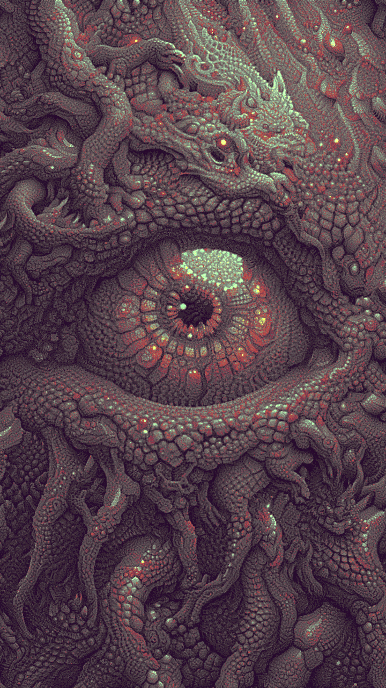
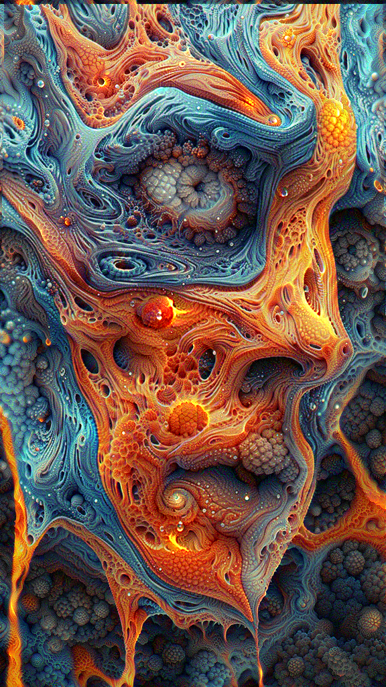
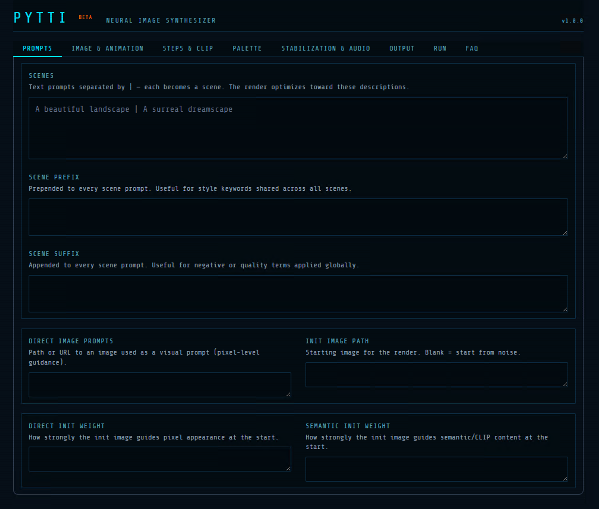

# PyTTI Portable

> Neural image synthesizer — text-to-image and animation powered by CLIP + VQGAN/Limited Palette

PyTTI Portable is a self-contained distributable of [pytti-core](https://github.com/pytti-tools/pytti-core) with a Gradio web UI. Everything is bootstrapped from a single `install.bat` — no system-wide Python required.


[](LICENSE)

<p align="center">
  
  
  
  
</p>

<p align="center">
  
</p>

## Features

- **Gradio web UI** with live preview, config save/load, and render controls
- **[3D animation](https://www.youtube.com/watch?v=W3oDPhUV0Pc)** with camera transforms (translate, rotate, zoom) and depth estimation
- **Multiple image models**: Limited Palette, VQGAN (multiple checkpoints)
- **CLIP-guided rendering** with multi-model ensemble (ViT-B/32, ViT-B/16, RN50x4, etc.)
- **Video Source mode** for style transfer onto existing video
- **Audioreactive** animation support
- **Config system** powered by Hydra — save, load, and share render presets as YAML files

## Requirements

- Windows 10 or 11
- NVIDIA GPU (GTX 10xx through RTX 40xx)
  - RTX 50xx (Blackwell) is **not supported**
- Up-to-date NVIDIA drivers
- [Git](https://git-scm.com) installed and on PATH
- ~8 GB disk space (after install)

## Quick Start

```
git clone https://github.com/pxl-pshr/pytti.git
cd pytti
```

1. Double-click **`install.bat`** (one-time, ~30-60 min)
2. Double-click **`launch.bat`**
3. A browser window opens — start rendering

To update: `git pull` from the pytti folder.

The first render will download CLIP and depth models (~1-4 GB), cached after that.

## Project Structure

```
pytti/
├── install.bat          # One-time installer (downloads Python, PyTorch, deps)
├── launch.bat           # Starts the Gradio UI
├── app/
│   ├── ui.py            # Gradio web UI
│   ├── patch_gradio.py  # Post-install dependency patches
│   └── config/
│       ├── default.yaml # Default render settings
│       └── conf/        # User-saved presets
└── examples/            # Sample renders
```

## How It Works

PyTTI uses CLIP to guide an image generator (Limited Palette or VQGAN) toward text prompts. In animation mode, each frame is warped via 2D/3D transforms with AdaBins depth estimation, then re-optimized toward the prompt — producing dreamlike, evolving visuals.

## Resources

- [Demo video](https://www.youtube.com/watch?v=W3oDPhUV0Pc) — pytti in action
- [pytti-book](https://pytti-tools.github.io/pytti-book/intro.html) — documentation, tutorials, and parameter guide
- [pytti-motion-preview](https://github.com/pxl-pshr/pytti-motion-preview) — camera motion preview tool
- [pytti-notebook](https://github.com/pytti-tools/pytti-notebook) — the original Colab notebook this project is based on

## Credits

- [David Marx](https://github.com/dmarx) & [sportsracer48](https://github.com/sportsracer48) — original pytti creators and maintainers
- [pytti-core](https://github.com/pytti-tools/pytti-core) — the rendering engine
- [CLIP](https://github.com/openai/CLIP) — OpenAI's vision-language model
- [taming-transformers](https://github.com/CompVis/taming-transformers) — VQGAN
- [AdaBins](https://github.com/shariqfarooq123/AdaBins) — monocular depth estimation (3D mode)
- [GMA](https://github.com/zacjiang/GMA) — optical flow for video mode
- [Gradio](https://gradio.app) — web UI framework

## License

MIT — see [LICENSE](LICENSE) for details.
