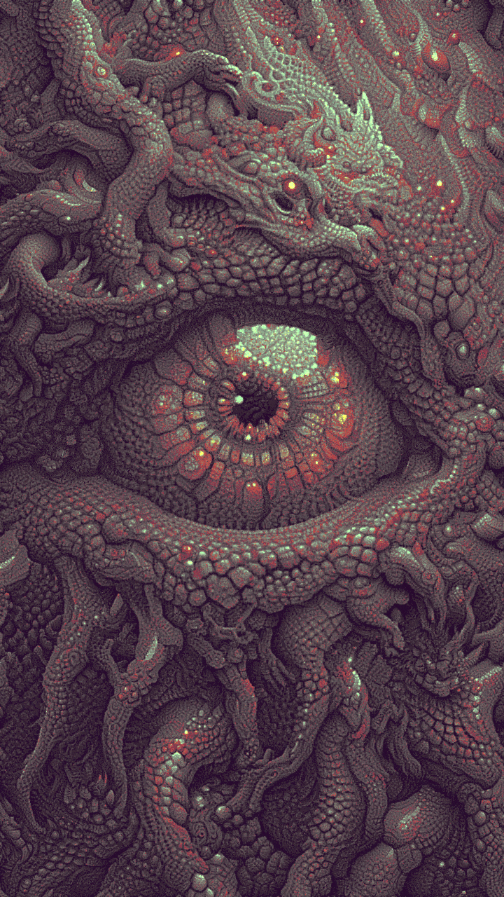
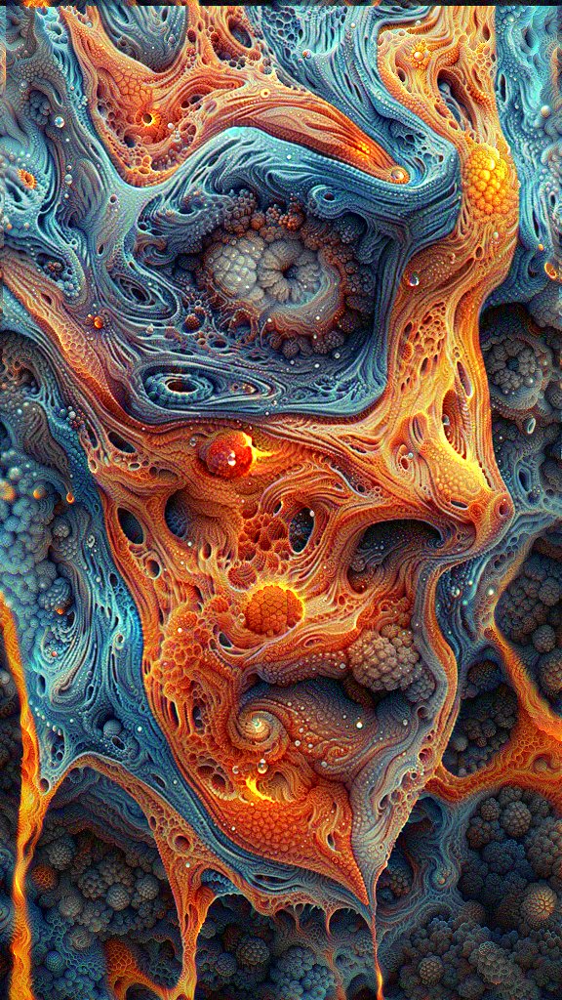
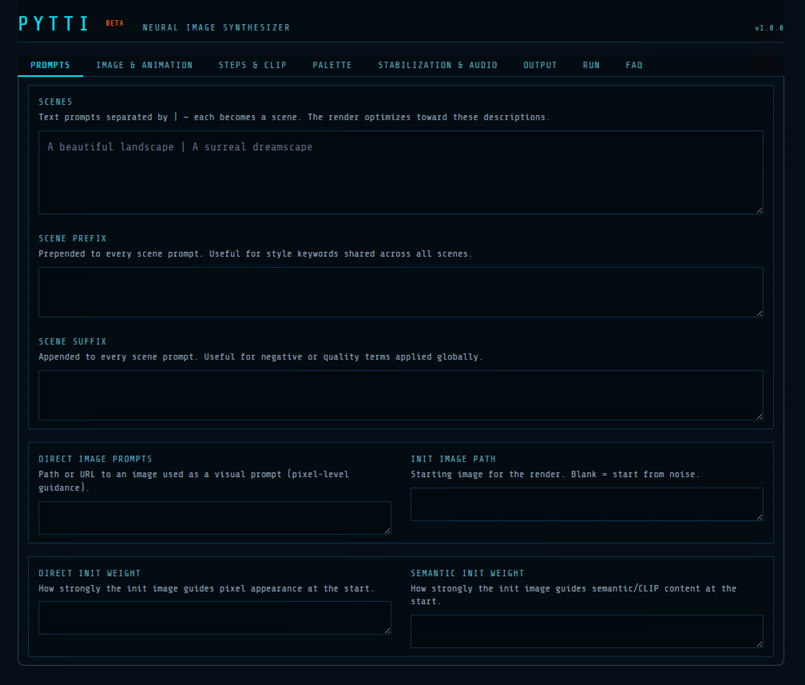

# PyTTI Portable

> Neural image synthesizer — text-to-image and animation powered by CLIP + VQGAN/Limited Palette

PyTTI Portable is a self-contained distributable of [pytti-core](https://github.com/pytti-tools/pytti-core) with a Gradio web UI. Everything is bootstrapped from a single `install.bat` — no system-wide Python required.


[](LICENSE)

<p align="center">
  
  
  
  
</p>

<p align="center">
  
</p>

## Features

- **Gradio web UI** with live preview, config save/load, and render controls
- **[3D animation](https://www.youtube.com/watch?v=W3oDPhUV0Pc)** with camera transforms (translate, rotate, zoom) and depth estimation
- **Multiple image models**: Limited Palette, Unlimited Palette, and VQGAN (imagenet, coco, wikiart, sflckr, openimages)
- **CLIP-guided rendering** with multi-model ensemble (ViT-B/32, ViT-B/16, RN50x4, etc.)
- **Video Source mode** for style transfer onto existing video, with optical flow keeping frames consistent
- **Breath mode** — linear crossfade from init image to CLIP-optimized output over the full render. Frame 1 is your original image; the final frame is fully transformed by CLIP. Creates smooth "emergence" animations showing the AI interpretation gradually taking over (best with little or no camera motion)
- **Video encoding** — built-in ffmpeg encoding (MP4 H.264, ProRes 4444, ProRes HQ) directly from the Output tab
- **Resume Render** — continue a render that was stopped, failed or cut off by a restart from its last backup, in the same run folder
- **Audioreactive** animation support (audio filters are set in the preset YAML)
- **Config system** powered by Hydra — save, load, and share render presets as YAML files. A preset can run code on your PC, so only render presets from people you trust; PyTTI checks each one before it renders (see [Troubleshooting](#troubleshooting))

## Requirements

- Windows 10 or 11 (64-bit)
- NVIDIA GPU from the GTX 10xx series through RTX 50xx, with 6 GB or more of video memory recommended
- NVIDIA driver 528.33 or newer (570.65 or newer recommended)
- [Git](https://git-scm.com), only to install with `git clone` and update with `git pull`
- [Microsoft Visual C++ Redistributable](https://aka.ms/vs/17/release/vc_redist.x64.exe) (x64)
- About 17 GB of free disk space on the drive the pytti folder is on, which doesn't have to be C:. Afterwards the `python` folder takes about 6.5 GB, and pip's download cache and the models take more, all inside the pytti folder (see [Disk space](#disk-space))
- 8 GB or more of RAM recommended

`install.bat` checks all of these before downloading anything and tells you what to fix.

## Quick Start

```
git clone https://github.com/pxl-pshr/pytti.git
cd pytti
```

Or download the ZIP from GitHub and extract all of it. Either way, keep the folder outside OneDrive (for example `C:\pytti`), since OneDrive would try to sync the whole install.

1. Double-click **`install.bat`** (one-time, ~20-60 min depending on your connection)
2. Double-click **`launch.bat`**
3. A browser window opens — start rendering

To update: `git pull` from the pytti folder; [CHANGELOG.md](CHANGELOG.md) lists what changed in each version. `launch.bat` applies any new pytti-core patches automatically. When an update also changes the packages PyTTI needs, `launch.bat` says the installed packages are out of date: run `install.bat` and answer Y to update them in place. pip skips the packages that are already up to date.

Installs made before RTX 50xx support was added run PyTorch 2.0 and keep working. To move one to PyTorch 2.7, which RTX 50xx cards need and which rendered 20-30% faster in tests on an RTX 4090, update it with `install.bat` the same way. That downloads PyTorch again (3.3 GB) and needs NVIDIA driver 528.33 or newer, which `install.bat` checks before it changes anything.

The first render downloads the CLIP and depth models, about 2 GB with the default settings, and keeps them for later renders (see [Disk space](#disk-space)). They come from PyTTI Portable's mirror on Hugging Face, [pxlpshr/pytti-models](https://huggingface.co/pxlpshr/pytti-models), with each file checked against its SHA-256. A model the mirror doesn't have, or can't deliver, is downloaded from its original source instead.

## Disk space

Everything PyTTI downloads stays in the pytti folder, so it needs space only on the drive the folder is on, and deleting the folder removes all of it.

- **`python`**: the embedded Python and its packages, about 6.5 GB.
- **`cache\pip`**: pip's download cache, with about 3.3 GB for the PyTorch wheel. Updates and reinstalls reuse it. Delete the folder to get the space back. While `install.bat` runs, pip's temporary files are in `cache\tmp`.
- **`cache\models`**: models, downloaded on first use:
  - `clip`: CLIP models, about 1.1 GB for the three that are on by default
  - `adabins`: the depth model for 3D mode, about 0.9 GB
  - `torch\hub`: a 120 MB model the depth model builds on
  - `vqgan`: VQGAN models, from 0.3 GB (coco) to 4.3 GB (sflckr) each
- **`cache\video`**: Video Source clips and video masks converted for pytti, one copy per clip and frame rate. Copies that no render has used for 30 days are deleted the next time a render reads a video.
- **Renders** are saved in `app\outputs`, one folder per run. Besides the frames and any videos you encode, each keeps its latest backups for Resume Render in its `backup` folder, 2 unless Backups is set higher, about 20 MB each at 512x512 with Limited Palette. When a render starts, its log shows about how much space it needs and how much is free.

Earlier versions downloaded the models to `%USERPROFILE%\.cache` instead, usually on C:. PyTTI still uses the models it finds there, so they aren't downloaded again, and it never moves or deletes them, since other programs that use CLIP or PyTorch may share the `clip` and `torch\hub` folders. To keep them in the pytti folder instead, for example to free up C: when the pytti folder is on another drive, close PyTTI and move the files from each of these folders to the folder of the same name in `cache\models` in the pytti folder, creating it if needed:

| From `%USERPROFILE%\.cache\` | To `cache\models\` in the pytti folder |
| --- | --- |
| `clip` | `clip` |
| `adabins` | `adabins` |
| `torch\hub` (`checkpoints\tf_efficientnet_b5_ap-9e82fae8.pth` and the `rwightman_gen-efficientnet-pytorch_master` folder) | `torch\hub` |
| `vqgan` | `vqgan` |

Leave files that other programs use where they are, or those programs download them again. Earlier versions also kept pip's download cache in `%LOCALAPPDATA%\pip\cache`, which every Python on the PC shares: `python\python.exe -m pip cache purge`, run from the pytti folder, empties it, including what other programs put there. Video Source conversions from earlier versions are in `%TEMP%\pytti-video-cache`, which can be deleted.

## Project Structure

```
pytti/
├── install.bat          # One-time installer (downloads Python, PyTorch, deps)
├── launch.bat           # Starts the Gradio UI
├── PROMPTING.md         # Prompt and preset format reference
├── CHANGELOG.md         # What changed in each version
├── python/              # Embedded Python and all packages (created by install.bat)
├── cache/               # pip's download cache, models and Video Source conversions (see Disk space)
├── app/
│   ├── ui.py            # Gradio web UI
│   ├── patch_gradio.py  # pytti-core patches (applied on install and every launch)
│   ├── model_mirror.py  # Fetches models from the Hugging Face mirror (copied into pytti-core)
│   ├── system_check.ps1 # Pre-install check: GPU, driver, disk space, etc.
│   ├── deps_rev.txt     # Revision of install.bat's package list
│   ├── constraints.txt  # Exact version of every package install.bat installs
│   ├── outputs/         # Renders, one folder per run (created on first render)
│   └── config/
│       ├── default.yaml # Default render settings
│       └── conf/        # User-saved presets
├── tests/               # Tests that need no GPU (see Tests; not in the ZIP download)
└── examples/            # Sample renders (not in the ZIP download)
```

## How It Works

PyTTI uses CLIP to guide an image generator (Limited Palette, Unlimited Palette or VQGAN) toward text prompts. In animation mode, each frame is warped via 2D/3D transforms with AdaBins depth estimation, then re-optimized toward the prompt — producing dreamlike, evolving visuals. Video Source mode follows an existing video instead, using GMA optical flow to keep frames consistent.

## Writing Prompts

[PROMPTING.md](PROMPTING.md) is the format reference for prompts and presets: the scene syntax, weights and stops, masks, time-based and audio-reactive weights, preset YAML and worked examples. It is written so you can hand it to an AI assistant and ask for a prompt or a preset that loads on the first try.

## Troubleshooting

- **Out of GPU memory**: lower the width and height, use fewer cutouts or CLIP models, or raise `gradient_accumulation_steps`.
- **Renders are slow**: on a GPU with 24 GB or more, set `gradient_accumulation_steps` to 1. It is about 25% faster than 2, gives the same result, and needs about 17 GB with the default settings instead of about 9 GB. If a render is far slower than usual, check Task Manager > Performance > GPU: rising "Shared GPU memory" means the render no longer fits in the GPU's memory and Windows is using system RAM; use the out-of-memory fixes above.
- **3D mode fails with `... to have 128 channels, but got N channels instead`**: the AdaBins depth model, which 3D mode and `depth_stabilization_weight` use, needs `(width * pixel_size) // 32` times `(height * pixel_size) // 32` to be at least 129. With `pixel_size` 1, 512×288 works and 512×256 doesn't. The UI checks this before it starts a render.
- **Start Render says a setting could run code on this PC**: pytti runs the expressions in weights and camera moves as Python code, and Hydra runs what a preset's `hydra:` section names, so a preset can do anything your Windows account can. Only render presets from people you trust. PyTTI checks a preset when you load it and before it renders: expressions may use numbers, arithmetic, `t`, math functions such as `sin()` and audio variables ([PROMPTING.md](PROMPTING.md#weights-that-change-over-time) lists them), and Start Render refuses a preset with a `hydra:` or `defaults:` section, or with `${...}` in a prompt, weight or camera move. Fix the setting the message names, or delete the section from the preset's file in `app/config/conf`.
- **A render stopped partway** (Stop Render, an error, a closed window or a restart): press **Resume Render** on the Run tab to continue the last render from its newest backup, in the same run folder and with the settings it was started with. To continue an earlier one, pick it in the Run list on the Output tab and press Resume Render there. Renders keep backups from their first saved frame on; most renders made before Resume Render was added have none.
- **A render fails with `WinError 4551` or "An Application Control policy has blocked this file"**: Windows' Smart App Control blocked one of PyTorch's files. It blocks files that aren't signed, and most of PyTorch's aren't. `install.bat` warns when it is on or in evaluation mode, and `launch.bat` when it is on, since Windows can switch it on later. To render, turn it off: Windows Security > App & browser control > Smart App Control settings > Off. On many Windows versions it can't be turned back on without reinstalling Windows. On a PC that a company or school manages, an App Control policy gives the same error; ask its IT department.
- **The UI doesn't open, and the `launch.bat` window says `When localhost is not accessible, a shareable link must be created`**: something on this PC kept PyTTI from reaching its own page at 127.0.0.1, such as a firewall, antivirus or VPN program that blocks local connections. Proxies are already bypassed for that address. Don't set `share=True` as the message suggests: that puts the UI on a public link, where anyone who has it can start renders, and renders can run code.
- **The install stopped partway**: run `install.bat` again. It offers to resume, or to delete the `python` folder and start over.
- **Starting over**: delete the `python` folder and run `install.bat` again. Your presets and renders in `app` are kept, and so are pip's download cache and the models in `cache` (see [Disk space](#disk-space)).

## Tests

The tests in `tests/` need no GPU and leave the `python` folder alone. They apply the pytti-core and kornia patches to the pristine pinned packages, run the settings checks behind Save and Start Render on the presets in the repo and on presets that must be accepted or refused, and check that the files agree on model names and wheels. GitHub's Download ZIP leaves them out, so clone the repository to run them. Run them from the pytti folder with Python 3.10, in a virtual environment of their own:

```
py -3.10 -m venv .venv
.venv\Scripts\python -m pip install -c app\constraints.txt -r tests\requirements.txt
.venv\Scripts\python -m pytest tests
```

The first run downloads the wheels `install.bat` installs and kornia, about 105 MB, into `tests\.cache`. Later runs check them against their SHA-256 and take about 10 seconds. `tests\test_mirror.py` checks that every model and wheel is on the Hugging Face mirror with the listed size and SHA-256; add `-m "not mirror"` to leave it out. GitHub Actions runs the tests on every push and pull request (`.github/workflows/tests.yml`), and the mirror check weekly and whenever `app/model_mirror.py` or `install.bat` changes (`mirror.yml`).

## Resources

- [Demo video](https://www.youtube.com/watch?v=W3oDPhUV0Pc) — pytti in action
- [pytti-book](https://pytti-tools.github.io/pytti-book/intro.html) — documentation, tutorials, and parameter guide
- [pytti-motion-preview](https://github.com/pxl-pshr/pytti-motion-preview) — camera motion preview tool
- [pytti-notebook](https://github.com/pytti-tools/pytti-notebook) — the original Colab notebook this project is based on

## Credits

- [David Marx](https://github.com/dmarx) & [sportsracer48](https://github.com/sportsracer48) — original pytti creators and maintainers
- [Katherine Crowson](https://github.com/crowsonkb) — CLIP-guided generation techniques pytti-core builds on
- [pytti-core](https://github.com/pytti-tools/pytti-core) — the rendering engine
- [CLIP](https://github.com/openai/CLIP) — OpenAI's vision-language model
- [taming-transformers](https://github.com/CompVis/taming-transformers) — VQGAN
- [AdaBins](https://github.com/shariqfarooq123/AdaBins) — monocular depth estimation (3D mode)
- [GMA](https://github.com/zacjiang/GMA) — optical flow for video mode
- [Gradio](https://gradio.app) — web UI framework

## License

MIT — see [LICENSE](LICENSE). [NOTICE](NOTICE) lists the parts derived from pytti-core and who holds their copyright.
